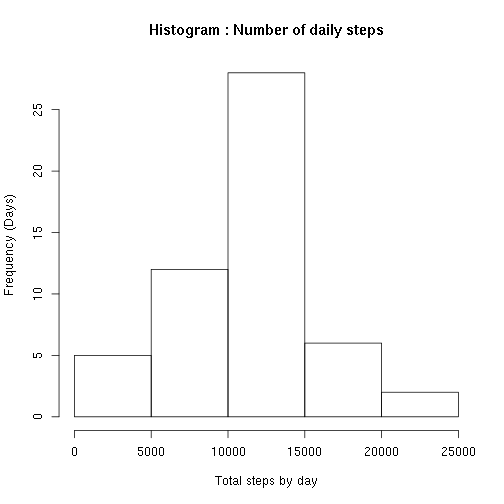
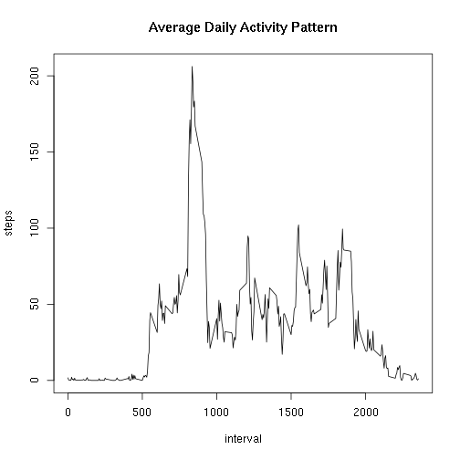
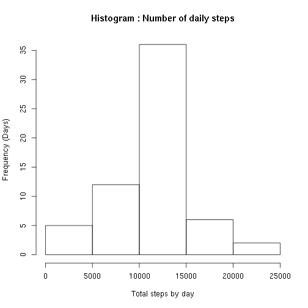
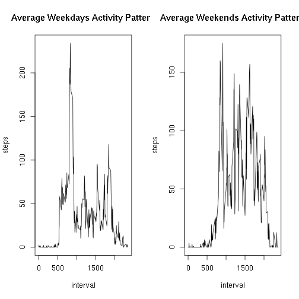

Loading and Processing Data
============================

1. Set the working directory.
2. Unzip the data.
3. Read the data in a variable called "Activity".
4. Transform the data into a format suitable for analysis.

```r
setwd("~/Documentos/WD_R/5_Reproducibe_Research/RepData_PeerAssessment1")
unzip('activity.zip')
Activity <- read.csv("activity.csv")
TotalSteps<-aggregate(steps~date,data=Activity,sum,na.rm=TRUE)
```

This is the processed data view:

```r
head(TotalSteps)
```

```
##         date steps
## 1 2012-10-02   126
## 2 2012-10-03 11352
## 3 2012-10-04 12116
## 4 2012-10-05 13294
## 5 2012-10-06 15420
## 6 2012-10-07 11015
```


What is mean total number of steps taken per day?
=================================================

1\. Histogram of the total number of steps taken each day

```r
hist(TotalSteps$steps,main="Histogram : Number of daily steps",xlab="Total steps by day", ylab="Frequency (Days)")
```

 

2\. Mean and median total number of steps taken per day:


```r
meansteps <- mean(TotalSteps$steps, na.rm=TRUE)
mediansteps <- median(TotalSteps$steps, na.rm=TRUE)
```

* The **mean** toal of steps taken per day is: **1.0766189 &times; 10<sup>4</sup>**.
* The **median** total of steps taken per day is: **10765**.


What is the average daily activity pattern?
===========================================

1\. Time series plot of the 5-minute interval and the average number of steps taken averaged across all days:

```r
StepsInt<-aggregate(steps~interval,data=Activity,mean,na.rm=TRUE)
plot(steps~interval,data=StepsInt,type="l", main="Average Daily Activity Pattern")
```

 

2\. Which 5-minute interval, on average across all the days in the dataset, contains the maximum number of steps?


```r
MaxSteps <- StepsInt$interval[which.max(StepsInt$steps)]
```

The 5-minute-interval with the maximum number of steps is: 835


Imputing missing values
=======================

1\. Total number of missing values in the dataset:

```r
TotalMV <- sum(is.na(Activity))
```

* The Total number of **NA values** is: **2304**.

2\. Devise a strategy for filling in all of the missing values in the dataset.

- My strategy will be to filling missing values of the original data with the mean for the 5-minute intervals.

3\. Create a new dataset that is equal to the original dataset but with the missing data filled in.

```r
ActivityFill <- merge(Activity, StepsInt, by="interval", suffixes=c("",".y"))
nas <- is.na(ActivityFill$steps)
ActivityFill$steps[nas] <- ActivityFill$steps.y[nas]
ActivityFill <- ActivityFill[,c(1:3)]
```

4\. Make a histogram of the total number of steps taken each day and Calculate and report the mean and median total number of steps taken per day.

```r
TotalSteps2<-aggregate(steps~date,data=ActivityFill,sum)
hist(TotalSteps2$steps, main="Histogram : Number of daily steps",xlab="Total steps by day", ylab="Frequency (Days)")
```

 

```r
meansteps2 <- mean(TotalSteps$steps, na.rm=TRUE)
mediansteps2 <- median(TotalSteps$steps, na.rm=TRUE)
```

* The **mean** toal of steps taken per day is: **1.0766189 &times; 10<sup>4</sup>**.
* The **median** total of steps taken per day is: **10765**.

5\. Do these values differ from the estimates from the first part of the assignment? What is the impact of imputing missing data on the estimates of the total daily number of steps?

- There are no difference between the mean and median calculated with NA's removed and the others calculated with de NA's filled-in missing values.


Are there differences in activity patterns between weekdays and weekends?
=========================================================================

1\. Create a new factor variable in the dataset with two levels -- "weekday" and "weekend" indicating whether a given date is a weekday or weekend day.

```r
Activity$day <- as.POSIXlt(Activity$date)$wday
Activity$day[Activity$day %in% c(6,0) ] <- "weekend"
Activity$day[Activity$day %in% c(1:5) ] <- "weekday"
SplitData <- split(Activity, Activity$day)

weekdays<-aggregate(steps~interval,data=SplitData[[1]],mean,na.rm=TRUE)
weekends<-aggregate(steps~interval,data=SplitData[[2]],mean,na.rm=TRUE)
```

2\. Make a panel plot containing a time series plot of the 5-minute interval (x-axis) and the average number of steps taken, averaged across all weekday days or weekend days (y-axis)

```r
par(mfrow=c(1,2))
plot(steps~interval,data=weekdays,type="l",main="Average Weekdays Activity Pattern")
plot(steps~interval,data=weekends,type="l", main="Average Weekends Activity Pattern")
```

 

- There are significative difference between the averages weekdays and weekends activity patterns. The weekend pattern show high activity (steps) during aslmost all intervals. The weekdays pattern show a peak of activity in ~800 interval but the rest of the pattern show low activity.
